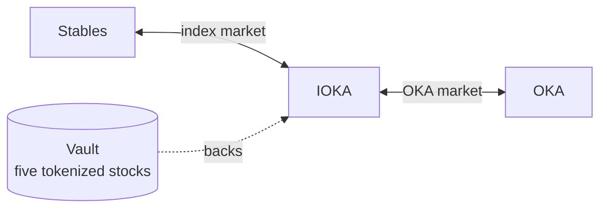
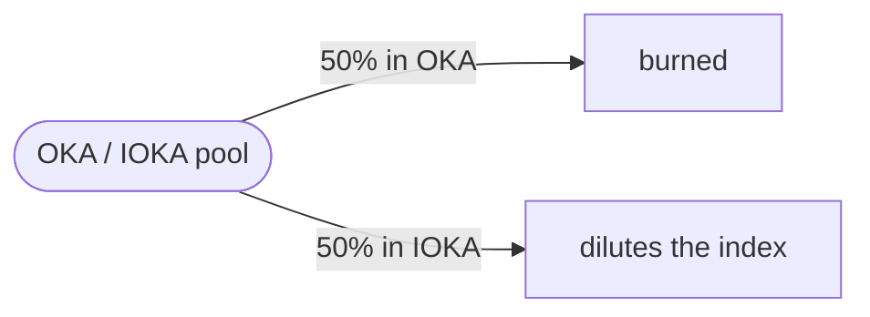

IOKA is an index of five tokenized stocks, held as one token.

OKA has a key role in the governance of that fund. You buy and sell OKA for IOKA, so the price follows the five stocks. When they rise, OKA is priced in a token that rose with them. The market is OKA / IOKA.

<Note>
  **Not live yet.** Nothing is minted or distributed, and the figures in the app are placeholders.
</Note>

## Why hold OKA

**It has a key role in governing the fund.** The fund is the five stocks inside IOKA.

**It follows those stocks.** OKA is priced in IOKA. When the five stocks rise, the token OKA is priced in rises with them.

**Its supply only falls.** OKA is minted once. Nothing can mint more. What is burned stays burned.

## The vault

The five stocks are held in a vault. That contract is the fund. It keeps the stocks and issues IOKA against them, so one IOKA is a share of what the vault holds.

## The two pools

Buying OKA with stables crosses both, left to right. The first hop is the market oka makes itself.

### IOKA / USDG, the index market

Where the index trades against a stable. oka runs this pool. It quotes a band around the value of the basket, bidding below and offering above, and moves that band as the basket moves.

When one side of the band is bought out, the vault restocks it: buying the five stocks and minting IOKA against them, or selling them and burning IOKA. The inventory is the fund.

### OKA / IOKA, the OKA market

Where OKA trades, priced in the index rather than in dollars. That is the pair. Liquidity stays in one pool instead of being split between a dollar market and an index market.

One IOKA is a share of the vault. There are only as many tokens as the vault has issued, and that ratio is the **net asset value**.

## How OKA is distributed

| | Share | |
|---|---|---|
| **Liquidity** | 70% | The pools have to be deep enough to trade against. |
| **Community incentive** | 25% | Returned to people who use the app. Locked. |
| **Treasury** | 5% | Supports the protocol and the app as they grow. Locked. |

## Where the fees go

Buying OKA with stables crosses both pools, so it pays into both. The two pools do not split the money the same way.

The protocol's own share is the **growth fund**. It is what finances growing oka.

### The OKA pool

**Half is taken in OKA and burned.** That supply is gone. Nothing can mint it back.

**Half is taken in IOKA and dilutes the index.** More IOKA stands against the same basket, so each IOKA is a smaller claim.

### The index pool

This pool charges **2%**. Half of that fee is taken in IOKA, half in USDG. Each half is split again, into the growth fund and a buyback of OKA.

| Slice of the 2% | Of the trade | Where it goes |
|---|---|---|
| Half of the IOKA | 0.5% | Growth fund |
| Half of the IOKA | 0.5% | Broken down, then used to buy OKA |
| Half of the USDG | 0.5% | Growth fund |
| Half of the USDG | 0.5% | Buys OKA |

The IOKA headed for the buyback is broken down first, because a basket cannot buy OKA directly. The USDG can.

### Market making

A Uniswap v4 hook and a bot make the market on the index pool, on top of the 2% fee.

The hook quotes IOKA against USDG and holds that price to the fair value of the five stocks in the fund. The bot manages the reserves with the vault. When one side of the pool runs low, it buys the five stocks and mints IOKA, or sells them and burns IOKA, so the pool can keep quoting at that value.

The fees generated by market making are used entirely to develop the project.

## Contracts

On Robinhood Chain. These addresses are placeholders.

| Contract | Address |
|---|---|
| **OKA** | `0x00000` |
| **IOKA** | `0x00000` |
| **Vault** | `0x00000` |
| **Uniswap v4 hook** | `0x00000` |

Platform fees on ordinary stock trades are a different line. They are on the [costs](/reference/costs) page.

<CardGroup cols={2}>
  <Card title="The sealed-bid auction" icon="gavel" href="/concepts/auction">
    How OKA is sold. Every filled bid pays the same price.
  </Card>
  <Card title="What it costs to trade stocks" icon="receipt" href="/reference/costs">
    The lines on an ordinary trade, which are not these.
  </Card>
</CardGroup>
