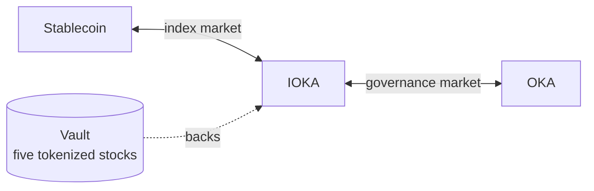
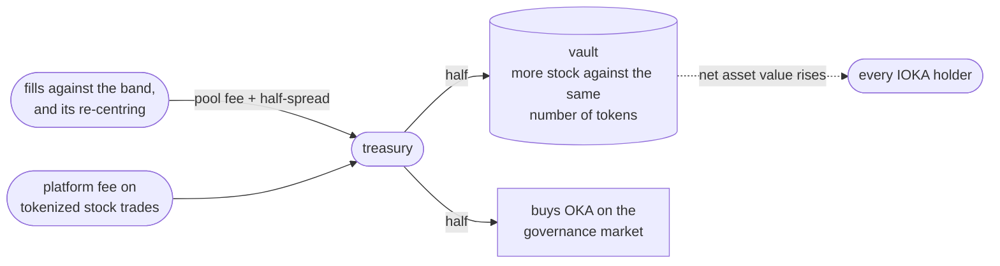

Two tokens with two jobs, and two pools that make them work together. Neither is a tokenized stock, and neither is something you need to understand to buy one.

<Note>
  **Not live yet.** The contracts are written and tested against a fork of mainnet, but nothing runs in production, and the figures shown in the app are placeholders.
</Note>

## The two tokens

### IOKA, the index fund

One token standing for a basket of five tokenized stocks held in a vault. One IOKA is a proportional claim on everything inside.

Buying that basket yourself means five trades, five spreads and five lots of gas, then the same again every time the weights drift. IOKA is one trade and one position.

Its value follows the basket, because there are only ever as many tokens as the vault has issued. That ratio of vault holdings to tokens in circulation is the **net asset value**, and everything below is measured against it.

### OKA, the governance token

OKA decides what IOKA holds: which five stocks, at which weights, and when the basket is rebalanced.

Supply is fixed. Minted once at deployment, with no mint path afterwards. No inflation, no later issuance, nothing to dilute.

The vault's basket functions are owner-controlled today. The layer that hands those rights to OKA holders is still to be built.

## The two pools

Buying OKA with a stablecoin crosses both, left to right. The first hop is the market oka makes itself, and it pays the band's spread, which the fund keeps.

### IOKA / USDG, the index market

Where the fund trades against a stablecoin. oka runs this pool itself, through a Uniswap v4 hook.

The hook is the market maker. It places the fund's own liquidity in a band around a centre anchored to the net asset value, bidding below and offering above, and re-lays that band as the basket moves. Two behaviours follow.

**It refuses rather than misprice.** If the pool drifts too far from what the basket is actually worth, the hook stops trading.

**It rebuilds instead of running dry.** When one side of the band is bought out, the hook goes to the vault and restocks: buying the five underlying stocks and minting IOKA against them, or selling them and burning. Its inventory is the fund itself.

### OKA / IOKA, the governance market

Where OKA trades, priced in fund units rather than in dollars.

OKA's claim is control over the fund, so it is quoted in shares of that fund rather than in dollars. That also keeps liquidity in one place instead of splitting it across two stablecoin pools.

<Note>
  On the test deployment, one transaction bought IOKA with the stablecoin on the hook's pool and swapped it for OKA on the second, paying the band's spread on the way through.
</Note>

## How OKA is distributed

| | Share | |
|---|---|---|
| **Liquidity** | 70% | The pools have to be deep enough to trade against. |
| **Airdrop** | 25% | Earned by using the platform. |
| **Team** | 5% | Address published once the treasury is set. |

<Card title="Earning points" icon="chart-line" href="/concepts/tokens#points">
  What counts, and what does not.
</Card>

## Points

Using oka earns points, and points decide the airdrop.

Four things count:

- **Volume traded.**
- **Fees paid.**
- **People you refer.**
- **Volume traded by the people you refer.**

The last two stack with the 40% fee share, which is paid separately and in stablecoins.

## Where the fees go

Every fill against the band pays the pool fee plus the band's half-spread, about **2%** one way. Re-centring as the basket moves earns more: the hook arbitrages its own quote back to fair value, and captures that spread instead of handing it to outside arbitrageurs.

Buying OKA feeds the same revenue, since it has to cross the band to get there.

<Note>
  The capture is on-chain and measured. The split below is treasury policy rather than something the contracts enforce. The hook pays its earnings to a single treasury address, and the allocation happens from there.
</Note>

**Half goes back into the fund.** The vault ends up holding more stock against the same number of tokens, so every holder's claim grows. You accumulate shares by holding, without buying any.

**Half buys OKA** on the market. Platform fees do the same. The token that governs the fund is bought with the money the fund and the platform make.

<Card title="What it costs to trade stocks" icon="receipt" href="/reference/costs">
  The lines on an ordinary trade, which are not these.
</Card>
