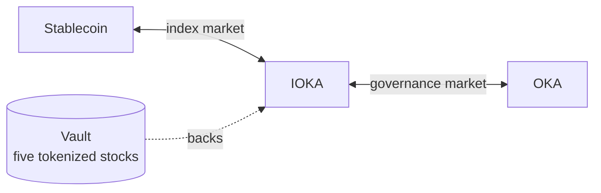
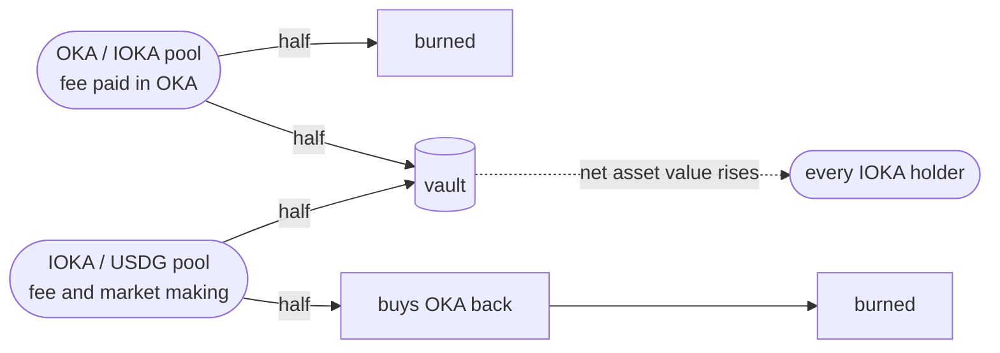

Two tokens with two jobs, and two pools that make them work together. Neither is a tokenized stock, and neither is something you need to understand to buy one.

<Note>
  **Not live yet.** The contracts are written and tested against a fork of mainnet, but nothing runs
  in production, and the figures shown in the app are placeholders.
</Note>

## The two tokens

### IOKA, the index fund

One token standing for a basket of five tokenized stocks held in a vault. One IOKA is a proportional claim on everything inside.

Buying that basket yourself means five trades, five spreads and five gas fees, then the same again every time the weights drift. IOKA is one trade and one position.

Its value follows the basket, because there are only ever as many tokens as the vault has issued. That ratio of vault holdings to tokens in circulation is the **net asset value**, and everything below is measured against it.

### OKA, the governance token

OKA decides what IOKA holds: which five stocks, at which weights, and when the basket is rebalanced.

Supply is fixed. Minted once at deployment, with no mint path afterwards. No inflation, no later issuance, nothing to dilute.

## The two pools

Buying OKA with a stablecoin crosses both, left to right. The first hop is the market oka makes itself, and it pays the band's spread, which the fund keeps.

### IOKA / USDG, the index market

Where the fund trades against a stablecoin. oka runs this pool itself, through a Uniswap v4 hook.

The hook is the market maker. It places the fund's own liquidity in a band around a centre anchored to the net asset value, bidding below and offering above, and re-lays that band as the basket moves. Two behaviours follow.

**It refuses rather than misprice.** If the pool drifts too far from what the basket is actually worth, the hook stops trading.

**It rebuilds instead of running dry.** When one side of the band is bought out, the hook goes to the vault and restocks: buying the five underlying stocks and minting IOKA against them, or selling them and burning. Its inventory is the fund itself.

### OKA / IOKA, the governance market

Where OKA trades, priced in fund units rather than in dollars.

OKA's claim is control over the fund, so it is quoted in shares of that fund rather than in dollars. That also keeps liquidity in one place instead of splitting it across two stablecoin pools.

## How OKA is distributed

Total supply is **10,000,000 OKA**.

|               | Amount    | Share |                         |
| ------------- | --------- | ----- | ----------------------- |
| **Auction**   | 6,000,000 | 60%   | Sold at launch.         |
| **Liquidity** | 3,500,000 | 35%   | Seeds the OKA/IOKA pool |
| **Team**      | 500,000   | 5%    | Locked.                 |

<Card title="Earning points" icon="chart-line" href="/concepts/tokens#points">
  What counts, and what does not.
</Card>

## Points

Using oka earns points, and points decide how the community incentive is allocated.

Four things count:

- **Volume traded.**
- **Fees paid.**
- **People you refer.**
- **Volume traded by the people you refer.**

The last two stack with the 40% fee share, which is paid separately and in stablecoins.

## Where the fees go

Each pool charges about **2%** one way: the pool fee plus the band's half-spread where the band is the one quoting. The band earns more than that on top, because re-centring is itself a trade: as the basket moves, the hook arbitrages its own quote back to fair value and keeps the spread instead of handing it to outside arbitrageurs. That market-making profit is treated as revenue like the rest.

Buying OKA with a stablecoin crosses both pools, so it pays into both.

What happens next depends on which pool the money arrived in, because the two collect in different tokens and only one of them can retire OKA without buying it first.

### The governance pool

The OKA / IOKA pool charges its fee in whichever token is being sold, so a day of selling leaves it holding OKA it has already issued.

**Half of it is burned.** No purchase is needed: the OKA is already there, and burning is the only way to retire it for good. Supply falls and never comes back, because nothing can mint OKA after deployment.

**Half goes into the vault.** It is converted and added to the basket, so the vault holds more stock against the same number of IOKA. Every holder's claim grows without them buying anything.

### The index pool

The IOKA / USDG pool, the one the band quotes, collects in stablecoins and fund units rather than in OKA.

**Half buys OKA on the governance market, and burns what it buys.** Retiring supply here takes two steps instead of one, and the purchase itself is a bid on the market it crosses.

**Half goes into the vault**, exactly as above: more stock behind the same number of tokens, and a higher net asset value for everyone holding IOKA.

Platform fees on ordinary stock trades are separate, and they are not part of this. They are described on the costs page.

<CardGroup cols={2}>
  <Card title="What it costs to trade stocks" icon="receipt" href="/reference/costs">
    The lines on an ordinary trade, which are not these.
  </Card>
  <Card title="OKA and IOKA in the app" icon="arrow-up-right" href="https://app.oka.finance/tokens">
    Net asset value, supply and the basket, live.
  </Card>
</CardGroup>
