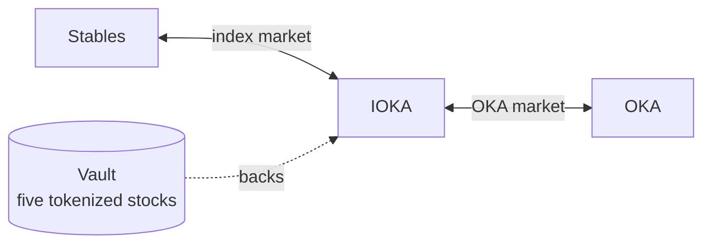
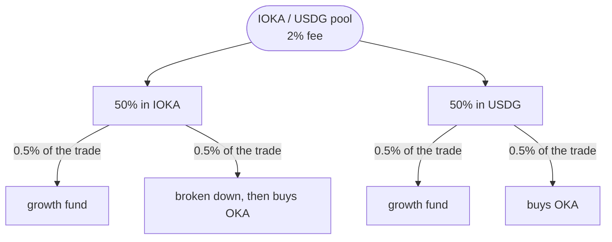

OKA plays a key role in the governance of the index fund. It is also a position quoted against that index rather than against a dollar.

IOKA is the index itself: five tokenized stocks, held in one vault, issued as one token. It is there so OKA has a pair. The OKA pool is OKA / IOKA. There is no OKA / stable pool.

<Note>
  **Not live yet.** Nothing is minted or distributed, and the figures in the app are placeholders.
</Note>

## Why hold OKA

**It has a key role in governing the index fund.** That is the fund behind IOKA.

**It moves with the stocks in the index.** OKA is priced in IOKA, not in dollars. When the five stocks in the index rise, the asset OKA is quoted against rises with them, and OKA moves with the basket instead of sitting flat against a stable.

**Its supply only falls.** OKA is minted once. Nothing can mint more. What is burned stays burned.

## The two pools

Buying OKA with stables crosses both, left to right. The first hop is the market oka makes itself.

### IOKA / USDG, the index market

Where the index trades against a stable. oka runs this pool. It quotes a band around the value of the basket, bidding below and offering above, and moves that band as the basket moves.

When one side of the band is bought out, the vault restocks it: buying the five stocks and minting IOKA against them, or selling them and burning IOKA. The inventory is the fund.

### OKA / IOKA, the OKA market

Where OKA trades, priced in the index rather than in dollars. That is the pair. Liquidity stays in one pool instead of being split between a dollar market and an index market.

One IOKA is a share of the vault. There are only as many tokens as the vault has issued, and that ratio is the **net asset value**.

## How OKA is distributed

| | Share | |
|---|---|---|
| **Liquidity** | 70% | The pools have to be deep enough to trade against. |
| **Community incentive** | 25% | Returned to the community through programmes that reward using oka. Locked. |
| **Treasury** | 5% | Supports the protocol and the app as they grow. Locked. |

<Card title="Earning points" icon="chart-line" href="/concepts/tokens#points">
  What counts, and what does not.
</Card>

## Points

Using oka earns points, and points decide how the community incentive is allocated.

Four things count:

- **Volume traded.**
- **Fees paid.**
- **People you refer.**
- **Volume traded by the people you refer.**

The last two stack with the 40% fee share, which is paid separately and in stables.

## Where the fees go

Buying OKA with stables crosses both pools, so it pays into both. The two pools do not split the money the same way.

The protocol's own share is the **growth fund**. It is what finances growing oka.

### The OKA pool

**Half is taken in OKA and burned.** That supply is gone. Nothing can mint it back.

**Half is taken in IOKA and dilutes the index.** More IOKA stands against the same basket, so each IOKA is a smaller claim.

### The index pool

This pool charges **2%**. Half of that fee is taken in IOKA, half in USDG. Each half is split again, into the growth fund and a buyback of OKA.

| Slice of the 2% | Of the trade | Where it goes |
|---|---|---|
| Half of the IOKA | 0.5% | Growth fund |
| Half of the IOKA | 0.5% | Broken down, then used to buy OKA |
| Half of the USDG | 0.5% | Growth fund |
| Half of the USDG | 0.5% | Buys OKA |

The IOKA headed for the buyback is broken down first, because a basket cannot buy OKA directly. The USDG can.

### Market making

On top of the 2%, the index pool earns another **2% to 5%** by quoting the market. All of it goes to the growth fund.

Platform fees on ordinary stock trades are a different line. They are on the [costs](/reference/costs) page.

<CardGroup cols={2}>
  <Card title="The sealed-bid auction" icon="gavel" href="/concepts/auction">
    How OKA is sold. Every filled bid pays the same price.
  </Card>
  <Card title="What it costs to trade stocks" icon="receipt" href="/reference/costs">
    The lines on an ordinary trade, which are not these.
  </Card>
</CardGroup>
