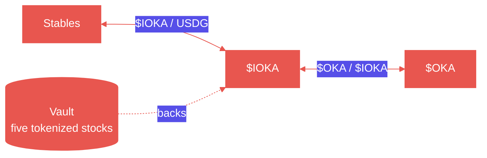
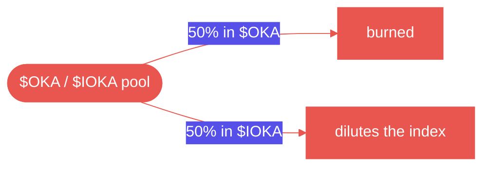
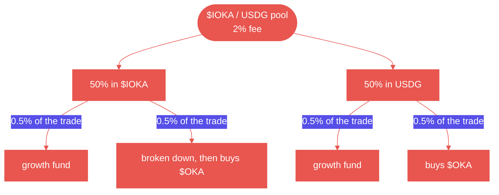

  

    
    
$OKA

    
Platform token

  

  

    
    
$IOKA

    
The index

  

\$OKA is the official platform token. It has a key role in the governance of the index fund.

You buy and sell \$OKA for \$IOKA. \$IOKA is five tokenized stocks held in one token, so when those stocks rise, \$OKA is priced in a token that rose with them. \$IOKA itself trades against  USDG. Stables enter and leave the index on that pool, and \$OKA sits on the other side of \$IOKA.

\$OKA is minted once. Trading fees burn part of the supply, and nothing can mint more.

The fees on both pools come back to \$OKA. The \$OKA pool burns half of its fee. The index pool uses part of its fee to buy \$OKA.

<Note>
  **Not live yet.** Nothing is minted or distributed, and the figures in the app are placeholders.
</Note>

## The vault

The five stocks sit in a vault. That contract is the fund. It holds the stocks and issues \$IOKA against them, so one \$IOKA is a share of what the vault holds.

## The two pools

Buying \$OKA with stables crosses both pools, left to right.

**\$IOKA /  USDG** is where the index trades against a stable. oka runs this pool. It quotes a band around the value of the five stocks and moves that band as the stocks move. When one side is bought out, the vault restocks it: buying the five stocks and minting \$IOKA, or selling them and burning \$IOKA.

**\$OKA / \$IOKA** is the only pool \$OKA trades in. \$OKA is priced in the index, not in a stable. The ratio of what the vault holds to \$IOKA in circulation is the **net asset value**.

That pool is how the market-making bot and other trading tools reach \$OKA. They trade it against \$IOKA, so the liquidity stays indexed to the five stocks.

## Where the fees go

A trade that buys \$OKA with stables pays a fee on each pool. Both of those fees do something for \$OKA.

The protocol's own share is the **growth fund**. It finances growing oka.

**The \$OKA pool**

Half of the fee is taken in \$OKA and burned. That supply is gone.

Half is taken in \$IOKA and dilutes the index. More \$IOKA stands against the same basket, so each \$IOKA is a smaller claim on the five stocks.

**The index pool** charges **2%**. Half of that fee is taken in \$IOKA, half in USDG. Each half splits again: one part to the growth fund, one part to buy \$OKA.

| Slice of the 2%    | Of the trade | Where it goes                       |
| ------------------ | ------------ | ----------------------------------- |
| Half of the \$IOKA | 0.5%         | Growth fund                         |
| Half of the \$IOKA | 0.5%         | Broken down, then used to buy \$OKA |
| Half of the USDG   | 0.5%         | Growth fund                         |
| Half of the USDG   | 0.5%         | Buys \$OKA                          |

The \$IOKA used for the buyback is broken down first, because a basket cannot buy \$OKA directly. The USDG can.

## Market making

A Uniswap v4 hook and a bot make the market on the \$IOKA / USDG pool, on top of the 2% fee.

The hook quotes \$IOKA against USDG and holds that price to the fair value of the five stocks. The bot manages the reserves with the vault. When one side of the pool runs low, it buys the five stocks and mints \$IOKA, or sells them and burns \$IOKA, so the pool can keep quoting at that value.

The fees from market making are used entirely to develop the project.

## How \$OKA is distributed

Total supply is **10,000,000 \$OKA**.

|               | Amount    | Share |                         |
| ------------- | --------- | ----- | ----------------------- |
| **Auction**   | 6,000,000 | 60%   | Sold in the [sealed-bid auction](/concepts/auction). |
| **Liquidity** | 3,500,000 | 35%   | Seeds the \$OKA / \$IOKA pool. |
| **Team**      | 500,000   | 5%    | Locked.                 |

## Contracts

On Robinhood Chain. These addresses are placeholders.

| Contract            | Address   |
| ------------------- | --------- |
| **\$OKA**           | `0x00000` |
| **\$IOKA**          | `0x00000` |
| **Vault**           | `0x00000` |
| **Uniswap v4 hook** | `0x00000` |

Platform fees on ordinary stock trades are a different line. They are on the [costs](/reference/costs) page.

<CardGroup cols={2}>
  <Card title="The sealed-bid auction" icon="gavel" href="/concepts/auction">
    How \$OKA is sold. Every filled bid pays the same price.
  </Card>
  <Card title="What it costs to trade stocks" icon="receipt" href="/reference/costs">
    The lines on an ordinary trade, which are not these.
  </Card>
</CardGroup>
